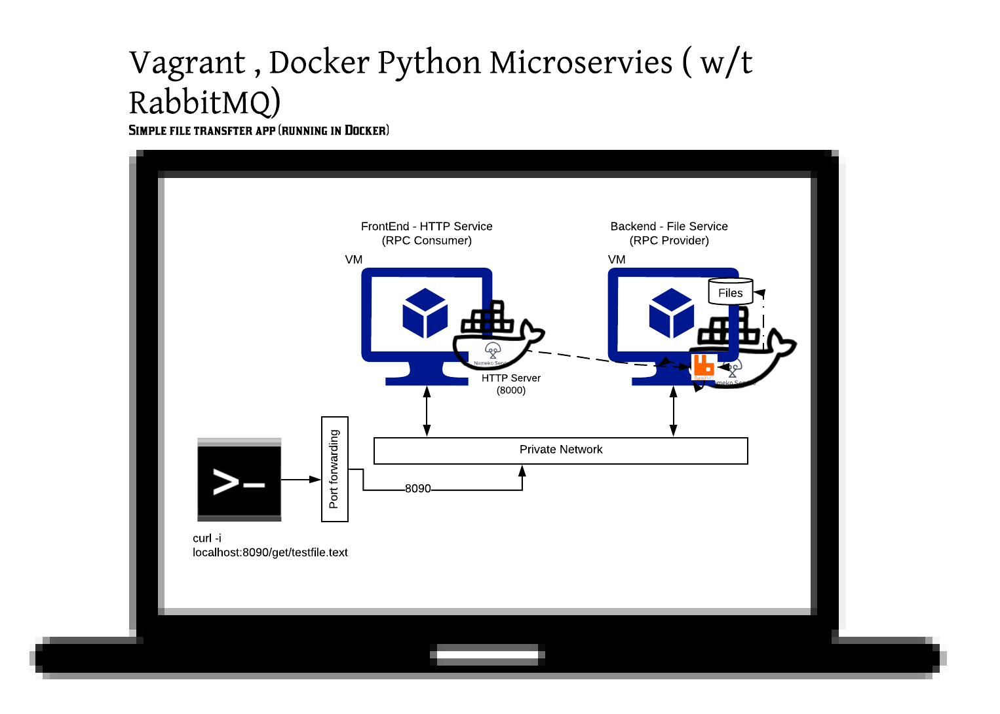

# devOps_w8

## Overview 
   
In this project we have two micro services - FrontEnd and BackEnd 

### BackEnd :

    It is Nameko based micro services that acts as file server - given a file name it can read content .
    Client interact with this service via RabbitMQ - files are transfered over RabbitMQ 

    RabbitMQ is also running along with micro service in Docker Container 

    In Repo you will find a Vagrant file that will create a Ubuntu 16 VM and inside that we install Docker and build a docker image 
      Docker image during build phase installs RabbitMQ , PIP & Nameko 
      Once Docker image has been built there is shell script that will start this container exposing RabbitMQ over port 7600 

      Port 7600 does not need to be exposed to outside world as all VM using private network can access them 

      File server only knows about files a.txt,b.txt,c.txt and e.txt anything else it will send you ~FILE NOT FOUND text as file content .

### FrontEnd :
   
    It is also Nameko based micro service that is basic HTTP Server - given Query string that has file name it will try to get file from back end file server over RabbitMQ    

    Same as above this Front End is also running in Docker container 

    Same as above - using Vagrant and then latter via Docker we create a Docker image that has this micro service running - it is exposed over port 80 
    Vagrant exposes port 80 to outside world over port 8090 

    Users can access FrontEnd via Browser or Curl tool with URL like 

    http://localhost:8090/get/b.txt

    You can change localhost to IP of your machine 


## Overall schematic view of How Micro Services are running 



## [Sample output] command line client running on Macbook (outside vagrant or docker)
   All the text content is Lorem Ipsum text  
``` BASH

➜  DevOps09 git:(master) ✗ curl -i localhost:8090/get/b.txt
HTTP/1.1 200 OK
Content-Type: text/plain; charset=utf-8
Content-Length: 643
Date: Wed, 10 Jul 2019 06:32:50 GMT

Nunc ultricies tempus purus non vulputate. Quisque pretium rutrum velit, eu porttitor lorem elementum id. Maecenas vulputate lobortis libero, eget luctus erat consequat sed. Duis sodales ullamcorper elit, sed ultrices eros eleifend a. Nulla hendrerit leo at orci commodo pulvinar. Nunc ultrices aliquam turpis, quis hendrerit felis. Pellentesque tristique, sapien sit amet condimentum tempor, neque metus viverra leo, sit amet volutpat metus massa vitae lorem. Nunc suscipit tristique massa. Pellentesque dignissim justo id eros commodo ultricies. Cras sed nunc dictum, laoreet felis vel, imperdiet elit. Cras placerat feugiat sem at maximus.


➜  DevOps09 git:(master) ✗ curl -i localhost:8090/get/c.txt
HTTP/1.1 200 OK
Content-Type: text/plain; charset=utf-8
Content-Length: 822
Date: Wed, 10 Jul 2019 06:32:54 GMT

Phasellus leo erat, consectetur at velit quis, ultrices suscipit nisi. Sed tortor nisl, dapibus id vulputate id, mollis nec ex. Vestibulum ante ipsum primis in faucibus orci luctus et ultrices posuere cubilia Curae; Sed nec est dolor. Lorem ipsum dolor sit amet, consectetur adipiscing elit. Aliquam erat volutpat. Suspendisse laoreet lobortis arcu, in mollis ex aliquam at. Aenean feugiat metus eget nisi interdum, nec vestibulum dolor sagittis. Mauris fringilla efficitur tincidunt. Nunc convallis venenatis sodales. Pellentesque habitant morbi tristique senectus et netus et malesuada fames ac turpis egestas. Praesent in elit a orci facilisis imperdiet a at libero. Aliquam diam ante, consectetur ultrices pulvinar auctor, dapibus ultrices augue. Morbi lorem elit, vestibulum sit amet nulla non, pulvinar dapibus sem.


➜  DevOps09 git:(master) ✗ curl -i localhost:8090/get/d.txt
HTTP/1.1 200 OK
Content-Type: text/plain; charset=utf-8
Content-Length: 793
Date: Wed, 10 Jul 2019 06:32:57 GMT

Sed pharetra mauris quis sapien ornare, eget fringilla est sodales. Donec vitae pellentesque dolor, et fermentum erat. Nullam rutrum diam ac posuere condimentum. Aenean sit amet interdum sem. Morbi faucibus ipsum eget felis vulputate suscipit. Nulla facilisi. Nullam interdum ligula in nunc vestibulum, eget vulputate felis finibus. Proin sed lobortis turpis.

Quisque eleifend quam nec laoreet interdum. Vestibulum accumsan tristique efficitur. Vestibulum scelerisque nec nisi vitae vulputate. Praesent ultricies dignissim nibh, nec egestas quam facilisis nec. Phasellus ligula erat, elementum vitae volutpat in, pellentesque at nulla. Aliquam consectetur condimentum varius. Etiam maximus sapien dui, non tempus sem volutpat id. Praesent leo nibh, laoreet eget porta non, tincidunt at enim.


➜  DevOps09 git:(master) ✗ curl -i localhost:8090/get/NewFile.txt
HTTP/1.1 404 NOT FOUND
Content-Type: text/plain; charset=utf-8
Content-Length: 26
Date: Wed, 10 Jul 2019 06:33:06 GMT

File NewFile.txt NOT_FOUND%                                                                  
```